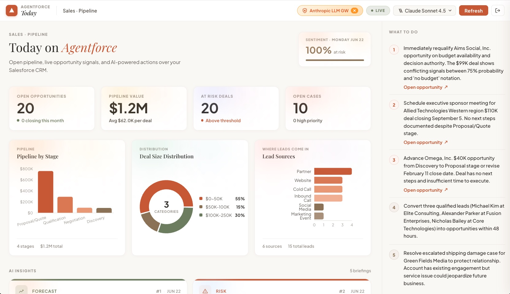
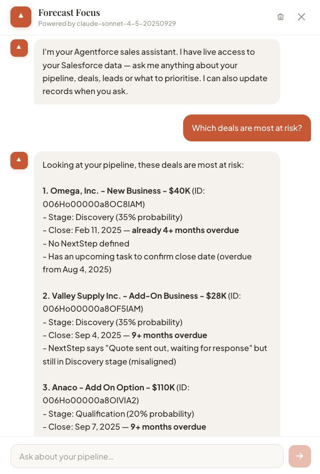
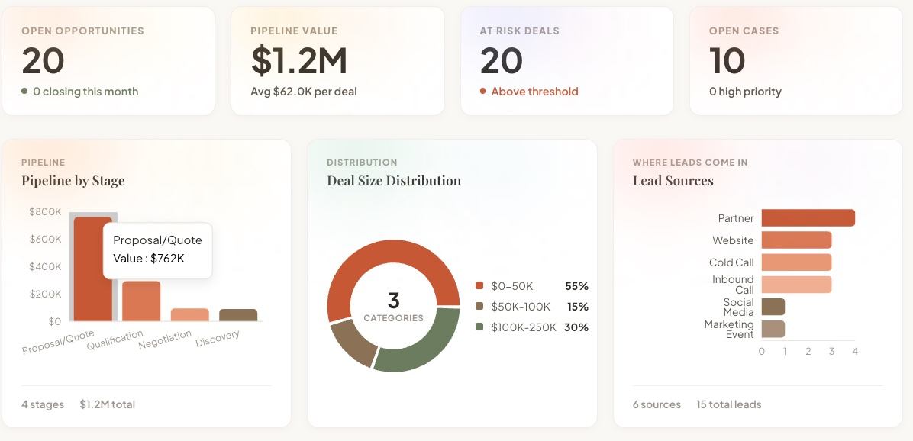

# Agentforce Today Remodel

A modern React + Express application that delivers AI-powered sales briefings using Salesforce data. Built with the Model Context Protocol (MCP) for secure Salesforce connectivity and integrated with AI models for intelligent insights.


## Features

- **OAuth 2.0 PKCE Authentication** — Secure browser-based login with Salesforce
- **Real-Time Dashboard** — KPIs, charts, and metrics from your Salesforce org
- **AI Sales Briefings** — Natural language summaries of opportunities, leads, and pipeline
- **Interactive Chat** — Ask questions about your data, request updates
- **Record Updates** — AI can update Salesforce records via the Models API
- **MCP Integration** — Uses Salesforce's Model Context Protocol for data access
- **Dual LLM Support** — Switch between Anthropic Claude and Salesforce Models API

## Screenshots

| Dashboard | AI Chat | Charts |
|-----------|---------|--------|
|  |  |  |

## Architecture

```
┌─────────────────┐      ┌─────────────────┐      ┌─────────────────┐
│   React App     │ ───▶ │  Express API    │ ───▶ │   Salesforce    │
│   (Vite)        │      │  (Node.js)      │      │   MCP Gateway   │
└─────────────────┘      └────────┬────────┘      └─────────────────┘
                                  │
                                  ▼
                         ┌─────────────────┐
                         │  Anthropic /    │
                         │  Models API     │
                         └─────────────────┘
```

## Prerequisites

- **Node.js** 18+ 
- **Salesforce Org** with API access
- **Connected App** configured for OAuth 2.0 PKCE
- **Anthropic API Key** (for AI features) — or Salesforce Models API access

## Quick Start

### 1. Clone and Install

```bash
git clone https://github.com/gyantsos123/agentforce-today-remodel.git
cd agentforce-today-remodel
npm install
```

### 2. Configure Salesforce Connected App

Create a Connected App in your Salesforce org:

1. **Setup** → **App Manager** → **New Connected App**
2. Enable OAuth Settings:
   - **Callback URL**: `http://localhost:3335/oauth/callback`
   - **Selected OAuth Scopes**:
     - `api` (Access and manage your data)
     - `refresh_token, offline_access`
     - `openid`
3. Enable **PKCE** (Require Proof Key for Code Exchange)
4. Save and copy the **Consumer Key** (Client ID)

### 3. Configure Environment

Copy the example environment file and fill in your values:

```bash
cp .env.example .env
```

Edit `.env`:

```env
# Salesforce MCP Server URL
MCP_SERVER_URL=https://api.salesforce.com/platform/mcp/v1/platform/sobject-all

# Salesforce OAuth 2.0 PKCE
SF_CLIENT_ID=your_connected_app_client_id
SF_LOGIN_URL=https://your-org.my.salesforce.com
SF_TOKEN_URL=https://your-org.my.salesforce.com
CALLBACK_URL=http://localhost:3335/oauth/callback

# Anthropic API key (get at https://console.anthropic.com)
ANTHROPIC_API_KEY=sk-ant-...

# Server port
PORT=3335
```

### 4. Run the Application

```bash
npm run dev
```

This starts both the Express server and Vite dev server concurrently.

Open **http://localhost:3335** in your browser.

## Usage

### Dashboard

After authenticating, the dashboard displays:
- **KPI Tiles** — Total pipeline, close rate, new leads, etc.
- **Pipeline Chart** — Opportunities by stage
- **Revenue Chart** — Revenue by product category
- **Lead Sources** — Distribution of lead origins

### AI Chat

Click the chat tab to interact with your data:

- *"What are my top 5 opportunities by amount?"*
- *"Summarize the deals closing this month"*
- *"Update the stage on Acme Corp to Negotiation"*
- *"Create a follow-up task for the GlobeTech opportunity"*

### Model Selection

Toggle between:
- **Anthropic Claude** — External AI with rich reasoning
- **Salesforce Models API** — Built-in AI with Trust Layer and audit logging

## Project Structure

```
agentforce-today-remodel/
├── server.js              # Express backend (OAuth, MCP, LLM proxy)
├── src/
│   ├── App.jsx            # Main React app
│   ├── App.css            # Styling
│   ├── components/
│   │   ├── AuthGate.jsx       # OAuth login flow
│   │   ├── DashboardPanel.jsx # KPIs and charts
│   │   ├── ForecastChat.jsx   # AI chat interface
│   │   ├── Header.jsx         # Navigation header
│   │   ├── KpiTile.jsx        # Metric display
│   │   └── charts/            # Recharts components
├── force-app/             # Salesforce metadata
│   └── main/default/connectedApps/
├── docs/                  # Documentation
├── .env.example           # Environment template
└── package.json
```

## API Endpoints

| Endpoint | Method | Description |
|----------|--------|-------------|
| `/oauth/login` | GET | Initiates OAuth 2.0 PKCE flow |
| `/oauth/callback` | GET | OAuth callback handler |
| `/oauth/token` | GET | Returns current access token |
| `/api/today` | GET | Fetches dashboard data via MCP |
| `/api/chat` | POST | AI chat with context |
| `/api/update-record` | POST | Update Salesforce record |
| `/api/create-record` | POST | Create Salesforce record |

## Security Notes

- **Never commit `.env`** — Contains secrets
- **PKCE** is required — No client secret needed
- **Tokens are session-scoped** — Stored in server memory only
- **Models API** uses Einstein Trust Layer for audit

## Troubleshooting

### OAuth Errors

- Verify `SF_CLIENT_ID` matches your Connected App
- Ensure callback URL is exactly `http://localhost:3335/oauth/callback`
- Check that PKCE is enabled on the Connected App

### MCP Connection Issues

- Confirm your user has API access
- Verify the MCP gateway URL is correct for your org
- Check that the Connected App has required OAuth scopes

### AI Chat Not Responding

- Verify `ANTHROPIC_API_KEY` is valid
- For Models API, ensure the app has `sfap_api` scope

## License

MIT

## Contributing

Pull requests welcome! Please open an issue first to discuss proposed changes.

---

Built with Salesforce MCP, React, and a lot of coffee.
